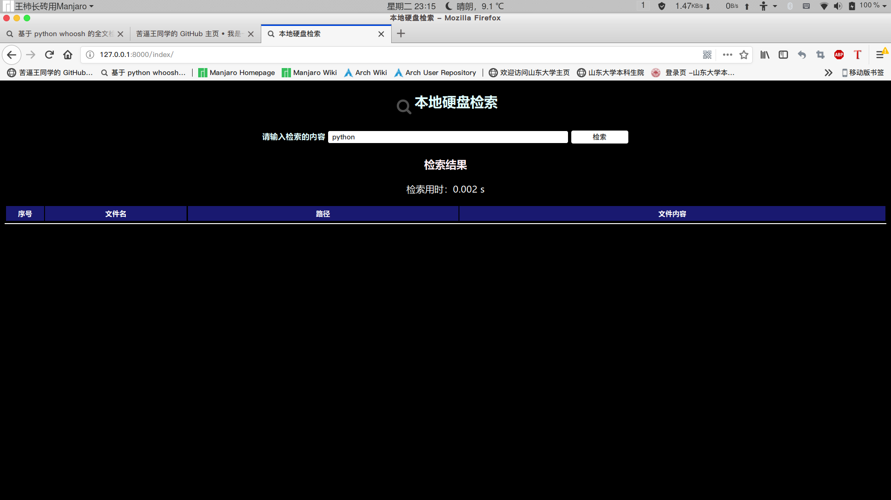
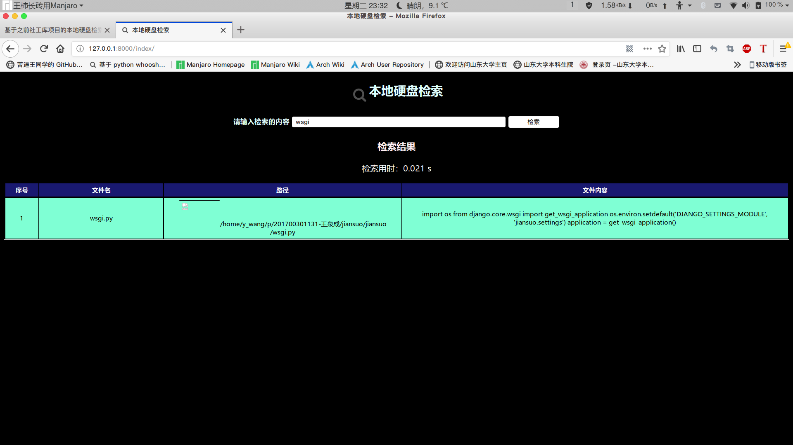

## 本地硬盘检索

### 检索内容
* 文件内容
* 文件名

### 支持的文件类型
* txt
* 各种程序语言文件
* docx文件
* xlsx文件
* pptx文件
* jpg,png等图片文件支持文件名搜索后预览

### 设计架构
* 利用 **Django框架**作为本地硬盘检索的框架，在本地构建一个小型的服务器
* 显示**搜索时间**，所有搜索出来的条目以及关键内容出现的位置

## 需要的python模块

都已经列在requirements文件里面
* whoosh == 2.7.4
* django == 2.1.3
* pytz == 2018.7
* jieba == 0.39
* lxml == 4.2.5

这四个模块是基本的利用Django进行全文检索以及中文分词，在之前的whoosh社工库简单的项目中已经提到过，不再多余进行赘述。

* python-docx == 0.8.7

这些模块可以帮助解析**docx文件**

下面是一个CSDN的链接，对python读取docx文件有比较不错的解读。也提到了无法处理doc格式的word文本，doc格式不是基于xml的。
> https://blog.csdn.net/churximi/article/details/79673494

其实针对微软在0ffice2003这样的**落后版本**中的doc文件，可以进行类型转换为docx以后再处理。

### 关于文件信息的获取
* **文件遍历**

看到了一个非常不错的遍历文件的方法（参考自林老师的wa）
```
def traverseFile(root):
    flist = []
    for f in os.listdir(root):
        f_path = os.path.join(root, f)
        if os.path.isfile(f_path):
            flist.append(f_path)
        else:
            flist += traverseFile(f_path)
    return flist
```
这样得到的文件都是文件的绝对路径
* **文件名称**

获取文件名的方法
```
os.path.basename(fn)
```
* **文件扩展名**

获取文件扩展名的方法
``` 
ext = os.path.splitext(fn)
```
* **文本文件读取**
``` 
def readFile(fn):
    with open(fn, 'r', encoding='utf-8') as f:
        lines = 0
        str = ""
        while True:
            line1 = f.readline()
            if line1:
                str += line1
                lines += 1
            else:
                break
    return str
```
* **显示图片**

当文件扩展名为jpg,png的时候返回一个路径，然后在html文件里进行选择即可。
``` 

```

### 针对docx文件的处理
* **读取docx文件**

一个比较好的教程网站
> https://www.cnblogs.com/beikew/p/8001164.html

```
def readDocx(fn):
    file = docx.Document(fn)
    str = ""
    for para in file.paragraphs:
        str += para
    return str
```
### 建立索引时出现的问题
* 问题
> UnicodeDecodeError: 'utf-8' codec can't decode byte 0xd0 in position 0: invalid continuation byte
* 一个暴力解决方案
> https://blog.csdn.net/wang7807564/article/details/78164855

```
line.decode("utf8","ignore")
```

虽然这个解决方法看起来用处不是很大，但是也算是能解决问题（最起码是看起来不报错）

### 建立索引并运行网页进行搜索
* **建立索引**

> python build_index.py
* **启动Django服务**

因为是在本地，因此也不需要挂载到Apache等服务器上

> python manage.py runserver 127.0.0.1:8000

* **打开浏览器**

进入 http://127.0.0.1:8000/即可

* **查询效果**

